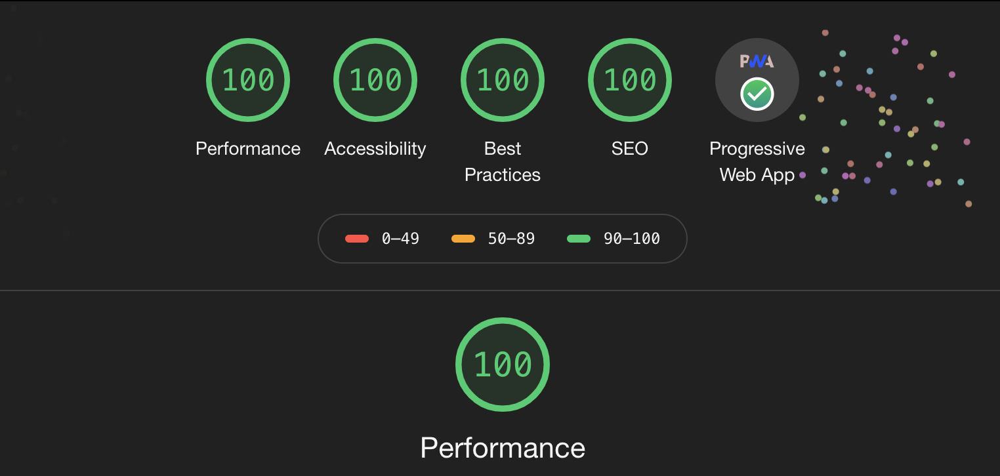

# Grids and Tables - Responsive App

A responsive grids and tables web application, built using React, TypeScript, NextJS, Redux, and Styled Components.

Live Demo: 🚀 https://grids-and-tables.now.sh

- 📱 **Responsive** - Works on mobile, tablets and desktops.
- ✨ **Server Side rendering** of data fetched from a REST API.
- 📙 Features a client side, regex based **search.**
- 🚩 Features client side **pagination** of data.
- 📅 Features client side **sorting** of data - Based on **Title and Date**.
- 📦 **Persist** last **Searched** and **Sorting Preferences** on the Client Side. Try refreshing the page, the state stays maintained.
- 🔈 Optimized for **accesibility**. 
- 📴 Works **Offline** - Install as a **PWA**. Configured via a Service Worker.
- 🚗 **Perfect score** for all parameters with Google **Lighthouse** Audit.
- 🚀 **Continous Deployment** with [Now.sh](http://now.sh/)
- 📜 Written in **TypeScript.**

## Perfect Lighthouse Score! 🚀 ⚛️ 

<p align="center">
<a href="https://grids-and-tables.now.sh" target="_blank"></a>
<p>

## Getting Started

### Prerequisites

- Node 10
- Yarn

### Setup

```bash
git clone

cd grids-and-tables

npm install || yarn install

npm run dev || yarn dev
```

App runs on [http://localhost:3000](http://localhost:3000)

### For Running a Production Ready Build

```bash
npm run start || yarn start
```

App runs on [http://localhost:3000](http://localhost:3000)

## Built With

- [React 16.12.0](https://reactjs.org/)
- [Redux](https://redux.js.org/)
- [Next JS](https://github.com/zeit/next.js)
- [Styled Components](https://www.styled-components.com/)
